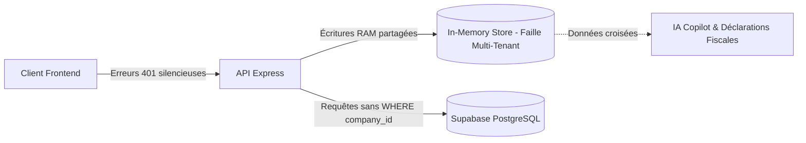

# Audit Technique & Plan des Problèmes : Multi-Tenancy & Supabase (GestCam)

> **Date d'audit :** Septembre 2026  
> **Contexte :** Application SaaS de gestion PME au Cameroun (normes OHADA & fiscalité DGI), déclarée **Multi-Tenant** et **déjà connectée à Supabase**.

---

## 1. Synthèse Exécutive

GestCam possède une excellente logique métier (TVA camerounaise à 19,25%, précompte AIRS 2,2% / 5,5%, intégration Mobile Money MTN/Orange, valorisation CMUP).

Cependant, sur le plan architectural, l'application présente **une dichotomie critique entre la base de données Supabase et un magasin mémoire partagé (RAM)** :
1. **Fuite d'isolation multi-tenant :** Plusieurs tables en base ne disposent d'aucun identifiant de tenant (`company_id`), et de nombreuses requêtes SQL sélectionnent l'ensemble des données de toutes les entreprises sans clause `WHERE`.
2. **Écritures fantômes en mémoire :** Les routes API majeures (facturation, mouvements de stock, trésorerie) écrivent dans un singleton JavaScript global (`server/data/store.ts`) plutôt que dans Supabase. Ce singleton est partagé entre toutes les entreprises connectées.
3. **Pertes de données au rechargement :** Les clients, fournisseurs, employés et bons de commande sont manipulés uniquement dans le state local React (`AppContext.tsx`) sans persistance backend.
4. **Appels frontend en erreur 401 non détectés :** Le chargement initial des données frontend utilise `window.fetch` natif sans transmettre le token d'authentification Bearer.

---

## 2. Inventaire Détaillé des Problèmes par Axe



### Axe 1 : Failles Critiques d'Isolation Multi-Tenant

#### 1.1 Tables Supabase dépourvues de `company_id` (`src/db/schema.ts`)
* **`suppliers` (Fournisseurs - Ligne 66) :** Aucun champ `company_id`. Les fournisseurs sont globaux. Une entreprise B voit et modifie les coordonnées des fournisseurs de l'entreprise A.
* **`treasury_accounts` (Comptes de trésorerie - Ligne 151) :** Aucun champ `company_id`. Les comptes Orange Money, MTN MoMo, Caisse et Banques sont mutualisés en base de données.
* **Tables totalement absentes du schéma SQL :**
  * `employees` (Personnel et pointage)
  * `purchase_orders` (Bons de commande fournisseurs)
  * `inventory_records` (Procès-verbaux d'inventaires contradictoires)
  * `mobile_money_payments` (Transactions de paiement mobile)

#### 1.2 Requêtes SQL non filtrées dans `server/services/pgService.ts`
Même pour les tables dotées d'un `company_id`, les méthodes du service omettent la restriction par tenant :
* **`getClients()` (Ligne 468) :**
  ```typescript
  // FAILLE : Renvoie l'intégralité des clients de tous les tenants
  const rows = await db.select().from(schema.clients);
  ```
* **`createClient()` (Ligne 478) :** N'insère pas le `companyId` dans la ligne créée, rendant le client orphelin ou accessible globalement.
* **`getStockMovements()` (Ligne 307) :** Renvoie l'historique des entrées/sorties de stock de toutes les entreprises confondues.
* **`getTreasuryTransactions()` (Ligne 518) :** Expose les flux financiers de l'ensemble des PME inscrites.
* **`getFraudAlerts()` (Ligne 547) :** N'isole pas les alertes anti-fraude par entreprise.

#### 1.3 Absence de Row Level Security (RLS) Supabase
* La connexion s'effectue via `src/db/index.ts` avec la chaîne de connexion directe PostgreSQL (utilisateur administrateur de pool).
* Aucune politique RLS (`ENABLE ROW LEVEL SECURITY`) ni variable de session PostgreSQL (`SET LOCAL app.current_tenant_id`) n'est mise en œuvre. La sécurité repose uniquement sur la rigueur des requêtes backend.

---

### Axe 2 : Désynchronisation Majeure Supabase vs In-Memory Store

#### 2.1 Écritures bloquées en mémoire vive (`server/data/store.ts`)
Dans la majorité des routes de l'API, les actions de gestion ne sont jamais envoyées à Supabase :
* **Facturation (`server/routes/invoices.ts` - Lignes 176 à 200) :**
  Lors d'un `POST /api/invoices`, l'application décrémente les stocks dans `db.products` (RAM), ajoute le mouvement dans `db.stockMovements` (RAM), et ajoute la facture dans `db.invoices` (RAM). **Aucune insertion SQL n'est effectuée sur Supabase**.
* **Mouvements de stock (`server/routes/stocks.ts` - Ligne 118) :**
  Le recalcul du CMUP et les entrées/sorties ne modifient que le tableau mémoire `db.stockMovements`.
* **Trésorerie (`server/routes/treasury.ts` - Ligne 36) :**
  `POST /api/treasury/transactions` met à jour `db.treasuryAccounts` en RAM sans enregistrer la transaction sur Supabase.
* **Erreurs de base de données étouffées (`server/routes/stocks.ts` - Ligne 92) :**
  ```typescript
  // FAILLE : Promesse non attendue et erreur avalée silencieusement
  pgService.addProduct(newProduct, companyId).catch(() => {});
  ```

#### 2.2 Données fantômes et conflits Lecture / Écriture
* `GET /api/invoices` effectue une lecture sur Supabase via `pgService.getInvoices(companyId)`.
* `POST /api/invoices` écrit dans `db.invoices` (RAM).
* **Conséquence :** Les factures créées disparaissent dès que l'utilisateur actualise la page ou que le serveur redémarre.

#### 2.3 Fuite de contexte dans le Copilote IA et la Télédéclaration Fiscale
* **Copilote IA (`server/routes/ai.ts` - Ligne 20) :** Le prompt système injecté à Gemini est généré à partir de `db.company`, `db.treasuryAccounts` et `db.products`. N'importe quelle entreprise connectée reçoit l'analyse financière de l'entreprise mockée en mémoire.
* **Déclaration DGI (`server/routes/tax.ts` - Ligne 18) :** Calcule le CA et la TVA nette à payer à partir des factures en mémoire `db.invoices` et des identifiants fiscaux (NIU/RCCM) statiques de `db.company`.

---

### Axe 3 : Authentification & Cohérence Technique

#### 3.1 Conflit d'authentification (Supabase vs Token maison vs Firebase)
* Le projet est connecté à Supabase pour la base de données mais **n'utilise pas Supabase Auth**.
* Il s'appuie sur une signature HMAC-SHA256 personnalisée (`server/middleware/auth.ts`) avec un secret de repli par défaut vulnérable (`'development-only-secret'`).
* Des dépendances et fichiers résiduels Firebase (`firebase`, `firebase-admin`, `src/lib/firebase.ts`, `firebase-applet-config.json`) subsistent et polluent le code, notamment dans `src/db/schema.ts` où `users.uid` est documenté comme `Firebase Auth UID`.

#### 3.2 Échecs 401 silencieux au montage de l'application (`src/context/AppContext.tsx`)
Aux lignes 189 à 191 de `AppContext.tsx` :
```typescript
// FAILLE : window.fetch n'envoie pas le header Authorization: Bearer <token>
fetch('/api/stocks/products').then((r) => r.json()).catch(() => null),
fetch('/api/invoices').then((r) => r.json()).catch(() => null),
fetch('/api/treasury/overview').then((r) => r.json()).catch(() => null)
```
Ces routes étant protégées par `authMiddleware`, ces requêtes renvoient une erreur `401 Unauthorized`. L'interface bascule alors sur des listes vides.

---

### Axe 4 : Données Frontend Non Persistées

Dans `src/context/AppContext.tsx` :
* **Clients :** La fonction `addClient` (Ligne 435) exécute uniquement `setClients((prev) => [newClient, ...prev])`. Aucun appel HTTP n'est fait. Il n'existe même pas de route `/api/clients` dans `server.ts`.
* **Fournisseurs :** `addSupplier` (Ligne 447) est purement local. Aucune route `/api/suppliers`.
* **Employés & Pointages :** Entièrement gérés en mémoire volatile dans le navigateur.
* **Bons de commande fournisseurs :** Données volatiles dans le navigateur.

---

### Axe 5 : Concurrence, Transactions et Normes OHADA

#### 5.1 Numérotation des factures non conforme et sujette aux doublons
Dans `server/routes/invoices.ts` (Ligne 150) :
```typescript
const seq = db.invoices.length + 900;
const invoiceNumber = `FACT-2026-${seq.toString().padStart(4, '0')}`;
```
* Si deux utilisateurs créent une facture en même temps, ils obtiendront le même numéro.
* Deux entreprises différentes obtiendront les mêmes numéros de facture.
* Non-respect de l'obligation légale OHADA : numérotation chronologique, continue et sans rupture propre à chaque entité juridique.

#### 5.2 Absence de transactions SQL ACID (`BEGIN ... COMMIT`)
L'émission d'une facture commerciale nécessite :
1. L'insertion de la facture.
2. L'insertion des lignes d'articles.
3. La décrémentation atomique des stocks.
4. L'enregistrement du bon de sortie en stock.
5. La mise à jour de la créance client.

En l'absence de transaction (`db.transaction()`), une coupure réseau ou un crash serveur laisse la base Supabase dans un état partiellement mis à jour et incohérent.

---

## 3. Plan d'Action & Roadmap de Correction

| Priorité | Domaine | Actions Concrètes | Statut |
| :---: | :--- | :--- | :---: |
| **P0** | **Schéma Supabase Multi-Tenant (Axe 1.1)** | 1. Ajout de `company_id` obligatoire (clé étrangère vers `companies.id`) sur :<br>&nbsp;&nbsp;• `suppliers`<br>&nbsp;&nbsp;• `treasury_accounts`<br>&nbsp;&nbsp;• `stock_movements`<br>2. Création des tables manquantes : `employees`, `purchase_orders`, `inventory_records`, `mobile_money_payments`.<br>3. Migration Supabase exécutée avec succès (`npm run db:push`). | ✅ **Fait** |
| **P1** | **Isolation Stricte des Requêtes SQL (Axe 1.2)** | Mise à jour de toutes les méthodes de `server/services/pgService.ts` (`getClients`, `getSuppliers`, `getTreasuryAccounts`, `getStockMovements`, `getInventoryRecords`, `getEmployees`, `getPurchaseOrders`, etc.) pour exiger `companyId` et appliquer systématiquement `where(eq(table.companyId, companyId))`. | ✅ **Fait** |
| **P0** | **Suppression du Store Mémoire (Axe 2)** | Éradication complète des imports `../data/store` dans l'ensemble des routes API (`invoices.ts`, `stocks.ts`, `treasury.ts`, `tax.ts`, `ai.ts`, `mobileMoney.ts`). Toutes les lectures et écritures transitent désormais directement par `pgService` connecté à Supabase avec isolation stricte du tenant. | ✅ **Fait** |
| **P1** | **Assainissement Auth & Headers Frontend (Axe 3)** | 1. Nettoyer les dépendances et fichiers résiduels Firebase.<br>2. Aligner l'authentification.<br>3. Remplacer les `fetch` natifs de `AppContext.tsx` par le service `api.ts` afin d'inclure le token Bearer. | ✅ **Fait** |
| **P2** | **Persistance Complète des Entités (Axe 4)** | 1. Créer les routes REST `/api/clients`, `/api/suppliers`, `/api/employees`, `/api/purchase-orders`.<br>2. Brancher les fonctions `addClient`, `addSupplier`, `addPurchaseOrder`, `updateAttendance` de `AppContext` sur ces routes avec mise à jour optimiste. | ✅ **Fait** |
| **P2** | **Conformité OHADA & Transactions (Axe 5)** | 1. Encapsuler la facturation dans une transaction Drizzle (`db.transaction`).<br>2. Créer une séquence ou un compteur atomique de facturation par `company_id`.<br>3. Alimenter le Copilote IA (`/api/ai/copilot`) et la déclaration DGI (`/api/tax/declaration-mensuelle`) avec les données Supabase filtrées du tenant actif. | 📅 *À venir* |
